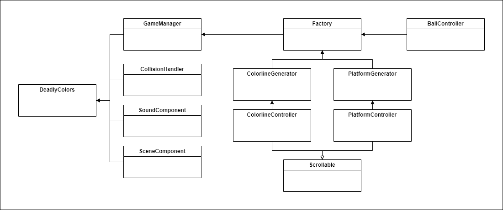

## Description
- The Deadly colors is jumping game focused on the player's perception and ability to make quick decisions. As the player progresses through the levels, he will be forced to change his strategy. Don't count on simply jumping, the random object generation won't let you make a single jump the same. That the first level was easy? So prove it, jump in and beat them all, it can't take much time. Instructions on how to play can be found in the game.

- I wish you luck and a lot of fun.

# Template for PIXIJS and ECSLite libraries

## Gallery
- all games that have been made by using this template can be found [here](https://aphgames.io/gallery) (search for the PIXI icon)

## What is ECSLite
- documentation of the ECSLite library that is a part of this repo can be found [here](https://aphgames.io/docs/learning/tutorials/ecsdocs)

## How to run this project
- the project is powered by ParcelJS, TypeScript, PixiJS and ECSLite libraries
- install [NodeJS](https://nodejs.org/en/download/)
- execute `npm install`
- execute `npm run dev`
- go to `localhost:1234` and find your template there
- **if you fork this project and rebase it to match the current version, don't forget to run `npm ci` to install new dependencies**

## Project structure

```
project
│
└───assets                  // folder where put game assets
│   
└───build                   // output folder for deployed project
│
└───libs                    // libraries and helpers
│   │   aph-math            // math library with structures
│   │   pixi-ecs            // ecslite component-oriented library for pixiJS
│   │   pixi-matter         // bridging components between pixiJS and matterJS
│
└───scripts                 // npm scripts
│   │   fix-links.js        // will fix relative paths in deployed files
│   │   prebuild-project.js // will copy static assets to the build folder before the main build process
│   │   utils.js            // various file utilities
│
└───src                     // source files of project
│   │   deadly-colors.ts          // the main source file that is included in the html file
│
└───view                    // folder with HTML content
│   │   index.html          // file that includes TS file with game
│
│   CHANGELOG.md            // changelog
│   package.json            // npm scripts and dependencies
│   README.md               // README file
│   tsconfig.json           // typescript config (only for pre-build)
```

## Architecture diagram


## Sounds used in game
I did not make any of these sounds. I get them on freesound.org and here are links to them:

* https://freesound.org/people/oussamaben/sounds/514833/
* https://freesound.org/people/16FPanskaSimonMartin/sounds/497156/
* https://freesound.org/people/Garuda1982/sounds/539502/
* https://freesound.org/people/Kenneth_Cooney/sounds/609335/
* https://freesound.org/people/Seth_Makes_Sounds/sounds/685334/ 
* https://freesound.org/people/Seth_Makes_Sounds/sounds/686776/ 

* all sounds were edited as needed